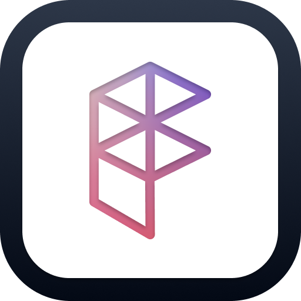

# Fluenticons

Find Microsoft Fluent UI System Icons by meaning, and get component names that really exist in
`@fluentui/react-icons`, instead of guessing. Ask for "user permissions", "billing" or "delete",
and Claude or Codex gets real icons with their React import, plus code for SVG, Blazor, Flutter,
WinUI/WPF, the icon font, Android, iOS and Power Apps. For a navigation bar or menu, it can pick a
matching set in one style and size.

Search is deterministic: it matches icon names, Microsoft's keywords and a synonym list, so it
never invents an icon. It's free and needs no account or API key.



## What's included

- **MCP server** `fluent-icons` at `https://fluenticons.co/mcp` (remote, Streamable HTTP, no
  authentication). Read-only tools:
  - `search_icons`: icons matching a meaning or name, best match first
  - `recommend_icons`: one icon per UI item, in a shared style and size
  - `get_icon`: every style, size and component name of one icon
  - `get_icon_code`: code for one icon on a given platform
  - `find_similar_icons`: related icons
- **Skill** `fluent-icons`: tells Claude when to look icons up and how to use the results.

## Install

Claude Code:

```bash
claude plugin marketplace add coltongriffith/fluenticons-plugin
claude plugin install fluenticons@fluenticons
```

Codex:

```bash
codex plugin marketplace add coltongriffith/fluenticons-plugin
codex plugin add fluenticons@fluenticons
```

Other setups (claude.ai, ChatGPT, Cursor, VS Code): https://fluenticons.co/ai/

## Data and privacy

The plugin talks only to fluenticons.co:

- Tool calls go to `https://fluenticons.co/mcp?via=plugin`. They send the tool arguments: search
  words, icon names, and the style, size and platform asked for. Your code, files and
  conversation are never sent.
- If the MCP tools aren't available, the skill can call the same data over
  `https://fluenticons.co/api/v1/` (for example with `curl`).
- fluenticons.co records the search words (first 100 characters), the icons returned, the
  platform, style and size, the kind of client (from its User-Agent) and whether it came from
  this plugin (`via=plugin`) in Google Analytics, to improve results. IP addresses are used only
  for rate limits and a monthly one-way hash; they're not stored or sent to Google.
- Icon page links in results include `utm_source` and `utm_medium` tags, so visits can be counted
  by client.

Full policy: https://fluenticons.co/privacy-policy/

## About

Fluenticons is an independent project by Colton Griffith and isn't affiliated with or endorsed by
Microsoft. The icons are Microsoft's Fluent UI System Icons, released under the MIT License.
This plugin is MIT licensed. Support: https://fluenticons.co/contact/ or colton@fluenticons.co.
